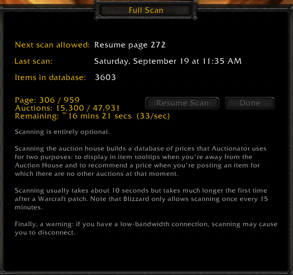

# Warmane Auctionator Full Scan Fix (WotLK 3.3.5a)
Unofficial Warmane patch for Auctionator Full Scan on WotLK 3.3.5a, with resume support, live progress, ETA, and safer paginated scanning.

A small compatibility patch for the old **Auctionator 2.6.8-style WotLK 3.3.5a addon** that restores usable **Full Scan** functionality on Warmane by avoiding the old `getAll` scan path that currently disconnects or stalls for many players.

> **Important:** This is an unofficial community patch. I am not affiliated with Auctionator, Warmane, WrathSilicon, or the original addon authors. I am simply a Warmane player who wanted working Full Scan functionality again.

---

## Version
Version 1.0.0 - Initial Release

## Screenshot




---

## 1. What is the issue?

Older WotLK versions of Auctionator use the original 3.3.5a Auction House **GetAll** query for Full Scan:

```lua
QueryAuctionItems("", nil, nil, 0, 0, 0, 0, 0, 0, true)
```

The final `true` asks the server to return the **entire Auction House in one response**.

Historically this was the fast way to scan the AH and could complete in seconds.

On Warmane, however, many players now see one of the following behaviours:

- clicking Full Scan disconnects the client after a few seconds;
- the first scan attempt disconnects;
- after reconnecting, the AH query remains stuck;
- Auctionator remains on `Scanning...`;
- TSM GetAll scans can show similar behaviour.

This is not limited to one addon. Warmane forum reports from 2025 and 2026 describe GetAll problems with Auctionator, Auctioneer and TSM.

### What about WrathSilicon?

I initially suspected **WrathSilicon** because I am running the WotLK client on Apple Silicon.

WrathSilicon may still influence how tolerant the client is of very large Auction House responses because it changes the runtime environment around the old Windows client.

However, testing strongly suggests it is **not the main cause**:

1. Normal paginated Auction House queries work.
2. A prepared/warmed-up query works normally.
3. The disconnect happens only a couple of seconds after the actual `getAll` request is sent.
4. Other Warmane players using different addons have reported the same GetAll disconnect behaviour.

So WrathSilicon may be a contributing factor in some setups, but the evidence points primarily towards how Warmane currently handles large `getAll` requests.

---

## 2. What has Warmane changed?

There is currently **no official Warmane statement that I could find confirming a specific anti-GetAll change**, so I do not want to claim that Warmane deliberately disabled Full Scan.

What we can confirm from testing and community reports is that the behaviour has changed compared with older Warmane usage.

Possible explanations include:

- anti-flood / anti-DoS protection being stricter around large AH queries;
- the server limiting or dropping `getAll` requests;
- GetAll being disabled or unreliable on the current server core;
- Warmane's unusually large Auction House causing the returned dataset to hit a server/client/network limit;
- the AH query gate remaining locked after an unanswered GetAll request.

Warmane forum users reported working GetAll scans in the past, while more recent reports describe immediate disconnects or queries that never complete.

For that reason, this patch does **not try to bypass Warmane's protections**.

Instead, it uses the normal supported page-query path as quickly as the client/server allows.

### References

- Warmane forum: GetAll scan disconnect reports (August 2025)  
  https://forum.warmane.com/showthread.php?t=479394

- Warmane forum: TSM GetAll disconnect / query stuck reports (January-February 2026)  
  https://forum.warmane.com/showthread.php?t=482919

- Warmane forum: Auctionator Full Scan stuck reports (January 2026)  
  https://forum.warmane.com/showthread.php?t=482885

- 3.3.5a Auctionator backport discussion of GetAll vs paginated scanning  
  https://github.com/JedborgWoW/Auctionator-3.3.5a

---

## 3. What does this patch add?

The replacement `AuctionatorScan.lua` removes the crashing GetAll-based Full Scan and replaces it with a **maximum-speed, event-driven page scanner**.

### Maximum-speed page scanning

WotLK returns normal Auction House search results in pages of approximately **50 auctions**.

The patch sends the next page as soon as:

```lua
CanSendAuctionQuery()
```

allows another request.

There is **no artificial one-second delay** between successful pages.

The flow is effectively:

```text
Query page
    ↓
AUCTION_ITEM_LIST_UPDATE
    ↓
Process 50 auctions
    ↓
CanSendAuctionQuery() available?
    ↓
Query next page immediately
```

The speed is therefore mostly limited by Warmane's response time and the 3.3.5a AH query throttle.

---

### Live Full Scan progress

The original Full Scan gives very little feedback while a scan is running.

This patch adds a live display such as:

```text
Page: 306 / 959
Auctions: 15,300 / 47,931
Remaining: ~16 mins 21 secs (33/sec)
```

It shows:

- current page;
- total pages;
- auctions already processed;
- total auctions detected;
- recent scan speed in auctions per second;
- estimated time remaining.

The ETA uses recent page timings rather than simply dividing by the total time since the scan started, which makes it more representative of current server performance.

---

### Resume functionality

One of the main improvements is **scan checkpointing**.

The scan stores its current progress in Auctionator's SavedVariables and tracks:

- next page to scan;
- total pages;
- total auctions;
- number of auctions already processed;
- price data gathered so far;
- final database-processing progress.

If the Auction House is closed during a scan, the patch pauses instead of throwing the work away.

When Full Scan is opened again, the button changes to:

```text
Resume Scan
```

and the UI shows something similar to:

```text
Next scan allowed: Resume page 272
```

The scan then continues from the next unprocessed page.

To deliberately throw away the saved checkpoint and begin again from page 1:

```text
Shift + click Resume Scan
```

---

### Prices are committed while scanning

The original scanner largely treats the scan as one temporary operation and builds the final database after the whole scan has completed.

This patch also updates Auctionator's normal scan database as pages are accepted.

That means the **Items in database** value rises during the scan:

```text
Items in database: 473
Items in database: 1,200
Items in database: 2,875
...
```

If a scan is interrupted, data from pages that have already completed is much less likely to be lost.

---

### Stale-page protection

Old 3.3.5a Auction House behaviour can occasionally fire:

```text
AUCTION_ITEM_LIST_UPDATE
```

before the local auction list has actually switched to the newly requested page.

Without protection, a scanner can accidentally process the previous 50 auctions twice.

The patch fingerprints the current page and detects this condition.

It first waits for the local AH data to settle without sending another network request.

Only if the page remains stale does it retry the query.

---

### Missing-response retry

If Warmane fails to respond to an individual page query, the scanner does not remain stuck forever.

It will retry that page and pause cleanly if repeated attempts still fail.

This is deliberately different from hammering the server with repeated requests.

---

### Final database processing

When all pages have completed, Auctionator finalises the collected data into its normal price database and mean-price history.

The final processing is chunked rather than performing one unnecessarily large block of work in a single frame.

---

## 4. Installation

### Requirements

This patch is intended for the old **WotLK 3.3.5a Auctionator 2.6.8-style addon codebase**.

It is **not** intended for modern Retail, Classic Era, Cataclysm Classic, or current retail Auctionator releases.

---

### Step 1 - Back up your existing file

Locate your WoW installation and open:

```text
Interface/AddOns/Auctionator/
```

Make a backup of:

```text
AuctionatorScan.lua
```

For example:

```text
AuctionatorScan.lua.backup
```

---

### Step 2 - Download the patched file

Download the patched:

```text
AuctionatorScan.lua
```

from this repository:

```text
YOUR_PUBLIC_GITHUB_REPOSITORY_URL
```

Replace the existing file at:

```text
Interface/AddOns/Auctionator/AuctionatorScan.lua
```

---

### Step 3 - Restart WoW

A complete restart of the WoW client is recommended after replacing the file.

Then:

1. log into Warmane;
2. open an Auction House;
3. open Auctionator;
4. open **Full Scan**;
5. click **Start Scanning**.

You should see live page and auction progress immediately.

---

## Resume after closing the Auction House

If you close the Auction House during the scan, the current checkpoint is retained.

Open the AH again and return to Full Scan.

You should see:

```text
Resume Scan
```

Click it to continue.

---

## Important limitation: hard disconnects / crashes

The patch checkpoints scan progress through WoW SavedVariables and commits price data during the scan.

Normal Auction House closure and normal logout can therefore be handled cleanly.

However, WoW itself controls when SavedVariables are physically written to disk.

If the client process crashes or the connection is terminated abruptly, the very latest in-memory checkpoint is **not guaranteed** to have reached disk yet.

This is a limitation of the WoW addon environment rather than Auctionator itself.

---

## Why not just make GetAll work?

Because the evidence suggests that the disconnect occurs on the server/network side when Warmane receives the GetAll request.

We tested:

```text
prepare normal AH query
    ↓
wait for query permission
    ↓
send GetAll
    ↓
~2 seconds
    ↓
disconnect
```

Delaying the request does not make the returned dataset smaller and does not change the type of request being sent.

The safe alternative is therefore to scan normal pages as quickly as Warmane permits.

This is slower than a working GetAll scan, but it is significantly more useful than being disconnected and getting no scan at all.

---

## Performance

A normal WotLK AH page contains around:

```text
50 auctions
```

For an Auction House with approximately:

```text
48,000 auctions
```

Auctionator needs roughly:

```text
960 pages
```

The scanner intentionally does **not** bypass `CanSendAuctionQuery()`.

Actual scan time depends mainly on:

- Warmane server load;
- realm latency;
- AH size;
- how quickly the server returns each 50-auction page.

For example, at:

```text
33 auctions/sec
```

a 48,000-auction scan will take approximately 20-25 minutes.

At higher server response rates it will complete considerably faster.

The status display continuously recalculates the remaining time.

---

## Disclaimer

I am **not affiliated with Auctionator or its original developers in any way**.

I am also not affiliated with Warmane or WrathSilicon.

I am simply a Warmane player who likes using Auctionator and wanted the old **Full Scan** feature to remain useful on WotLK 3.3.5a.

The original addon and all original Auctionator code belong to their respective authors.

This patch only modifies the Full Scan behaviour needed for compatibility with the current Warmane Auction House behaviour and adds a few quality-of-life improvements around progress, retries and scan resuming.

If the original Auctionator developers or maintainers want anything changed, credited differently, or removed, I am happy to do so.

---

## Summary

The patch provides:

- Warmane-safe Full Scan without `getAll`;
- maximum-speed event-driven page queries;
- live page progress;
- live auction count;
- live auctions-per-second rate;
- human-readable ETA;
- stale-page detection;
- dropped-response retries;
- partial database updates during scanning;
- persistent scan checkpoints;
- Resume Scan support after closing the AH;
- resumable final database processing;
- Shift-click to discard a saved checkpoint and start again.

It is not as fast as a working GetAll scan, but it restores reliable Full Scan functionality without triggering the disconnect behaviour currently seen by many Warmane users.

## Licensing / Attribution

This repository contains a compatibility modification to Auctionator.

Auctionator and the original Auctionator source code remain the property of their
respective authors and copyright holders. I do not claim ownership of the original
Auctionator code and do not grant any additional licence to it.

The changes in this repository are provided solely as an unofficial compatibility
patch for Warmane WotLK 3.3.5a.

I am not affiliated with Auctionator, Warmane, or WrathSilicon.