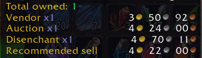

# Warmane Auctionator Full Scan Fix (WotLK 3.3.5a)

Unofficial Warmane compatibility patch for the old Auctionator 2.6.8-style WotLK 3.3.5a addon.

It replaces the unreliable `getAll` Full Scan path with safer paginated scanning and now also adds resumable scans, Smart Quick Refresh, disenchant-price support, recommended sell prices, database controls, and several quality-of-life improvements - all from a single replacement `AuctionatorScan.lua` file.

> **Important:** This is an unofficial community patch. I am not affiliated with Auctionator, Warmane, WrathSilicon, or the original addon authors. I am simply a Warmane player who wanted the old Auctionator workflow to remain useful on WotLK 3.3.5a.

---

## Version

**Version 1.0.1**

## TLDR
1. Locate your WoW installation and open:

```text
Interface/AddOns/Auctionator/
```

2. Make a backup of:

```text
AuctionatorScan.lua
```

For example:

```text
AuctionatorScan.lua.backup
```

3. Download `AuctionatorScan.lua` from:

https://github.com/m3n0tu18/warmane-auctionator-full-scan-fix

4. Replace:

```text
Interface/AddOns/Auctionator/AuctionatorScan.lua
```

with the patched version.

No other Auctionator files need to be replaced for this patch.

5. Restart WoW

A complete restart of the WoW client is recommended after replacing the file.

..End..


### v1.0.1 highlights

- Smart Quick Refresh for bags, cached bank contents, shopping lists, and Recent Searches
- 15-minute freshness cache to avoid unnecessary repeated AH queries
- selective refresh of only the disenchant materials relevant to the equipment being checked
- working Auctionator disenchant values after Quick Refresh
- `Recommended sell` value added to item tooltips
- sell-pane price prefill from refreshed Auctionator data
- `Clear DB` button
- Quick Refresh can run while a Full Scan is paused
- Full Scan checkpoint remains untouched while Quick Refresh runs
- compact Full Scan mask so the Auction House can still be closed normally
- scrollable help text in the Full Scan window
- existing Full Scan resume, ETA, stale-page protection, and safe retry behaviour retained

### v1.0.0

Initial Warmane-safe Full Scan release.

---

## Screenshot


---

## 1. What is the issue?

Older WotLK versions of Auctionator use the original 3.3.5a Auction House **GetAll** query for Full Scan:

```lua
QueryAuctionItems("", nil, nil, 0, 0, 0, 0, 0, 0, true)
```

The final `true` asks the server to return the **entire Auction House in one response**.

Historically this was the fast way to scan the AH and could complete in seconds.

On Warmane, however, many players now see one or more of the following behaviours:

- clicking Full Scan disconnects the client after a few seconds;
- the first scan attempt disconnects;
- after reconnecting, the AH query remains stuck;
- Auctionator remains on `Scanning...`;
- TSM GetAll scans can show similar behaviour.

This does not appear to be limited to one addon. Warmane forum reports from 2025 and 2026 describe GetAll problems with Auctionator, Auctioneer, and TSM.

### What about WrathSilicon?

I initially suspected **WrathSilicon** because I am running the WotLK client on Apple Silicon.

WrathSilicon may still influence how tolerant the client is of very large Auction House responses because it changes the runtime environment around the old Windows client.

However, testing strongly suggests it is **not the main cause**:

1. Normal paginated Auction House queries work.
2. A prepared/warmed-up query works normally.
3. The disconnect happens only a couple of seconds after the actual `getAll` request is sent.
4. Other Warmane players using different addons have reported the same GetAll disconnect behaviour.

So WrathSilicon may be a contributing factor in some setups, but the evidence points primarily towards how Warmane currently handles large `getAll` requests.

---

## 2. What has Warmane changed?

There is currently **no official Warmane statement that I could find confirming a specific anti-GetAll change**, so I do not want to claim that Warmane deliberately disabled Full Scan.

What can be confirmed from testing and community reports is that the behaviour is different from older Warmane usage.

Possible explanations include:

- anti-flood / anti-DoS protection being stricter around large AH queries;
- the server limiting or dropping `getAll` requests;
- GetAll being disabled or unreliable on the current server core;
- Warmane's unusually large Auction House causing the returned dataset to hit a server/client/network limit;
- the AH query gate remaining locked after an unanswered GetAll request.

Warmane forum users reported working GetAll scans in the past, while more recent reports describe immediate disconnects or queries that never complete.

For that reason, this patch does **not** try to bypass Warmane's protections.

Instead, it uses the normal supported page-query path as quickly as the client/server allows.

### References

- Warmane forum: GetAll scan disconnect reports (August 2025)  
  https://forum.warmane.com/showthread.php?t=479394

- Warmane forum: TSM GetAll disconnect / query stuck reports (January-February 2026)  
  https://forum.warmane.com/showthread.php?t=482919

- Warmane forum: Auctionator Full Scan stuck reports (January 2026)  
  https://forum.warmane.com/showthread.php?t=482885

- 3.3.5a Auctionator backport discussion of GetAll vs paginated scanning  
  https://github.com/JedborgWoW/Auctionator-3.3.5a

---

## 3. What does this patch add?

The replacement `AuctionatorScan.lua` keeps the original Auctionator addon intact while replacing and extending the old scan behaviour from one file.

The main additions are described below.

---

## Warmane-safe Full Scan

### Maximum-speed paginated scanning

WotLK returns normal Auction House search results in pages of approximately **50 auctions**.

The patch sends the next page as soon as:

```lua
CanSendAuctionQuery()
```

allows another request.

There is **no artificial delay** between successful pages.

The flow is effectively:

```text
Query page
    ↓
AUCTION_ITEM_LIST_UPDATE
    ↓
Process page
    ↓
CanSendAuctionQuery() available?
    ↓
Query next page immediately
```

The speed is therefore mostly limited by Warmane's response time and the 3.3.5a AH query throttle.

### Live Full Scan progress

The original Full Scan gives very little feedback while a scan is running.

This patch adds a live display such as:

```text
Page: 306 / 959
Auctions: 15,300 / 47,931
Remaining: ~16 mins 21 secs (33/sec)
```

It shows:

- current page;
- total pages;
- auctions already processed;
- total auctions detected;
- recent scan speed in auctions per second;
- estimated time remaining.

The ETA uses recent page timings rather than simply dividing by total elapsed time, so it tracks current server performance more closely.

### Resume functionality

One of the main improvements is **scan checkpointing**.

The scan stores its current progress in Auctionator's SavedVariables and tracks:

- next page to scan;
- total pages;
- total auctions;
- number of auctions already processed;
- price data gathered so far;
- final database-processing progress.

If the Auction House is closed during a scan, the patch pauses instead of throwing the work away.

When Full Scan is opened again, the button changes to:

```text
Resume Scan
```

and the UI shows something similar to:

```text
Next scan allowed: Resume page 272
```

The scan then continues from the next unprocessed page.

To deliberately throw away the saved checkpoint and begin again from page 1:

```text
Shift + click Resume Scan
```

### Quick Refresh while Full Scan is paused

A saved Full Scan checkpoint no longer blocks Quick Refresh.

If a Full Scan is paused at, for example:

```text
Resume page 154
```

you can run Quick Refresh without losing or advancing that checkpoint.

When Quick Refresh finishes, `Resume Scan` is still available from the same saved page.

Full Scan and Quick Refresh are still prevented from actively querying the Auction House at the same time.

### Prices are committed while scanning

The patch updates Auctionator's normal scan database as Full Scan pages are accepted.

That means the **Items in database** value rises during the scan:

```text
Items in database: 473
Items in database: 1,200
Items in database: 2,875
...
```

If a scan is interrupted, prices from already completed pages remain available in memory and are much less likely to be lost.

### Stale-page protection

Old 3.3.5a Auction House behaviour can occasionally fire:

```text
AUCTION_ITEM_LIST_UPDATE
```

before the local auction list has actually switched to the newly requested page.

Without protection, a scanner can accidentally process the previous 50 auctions twice.

The patch fingerprints the current page and detects this condition.

It first waits for the local AH data to settle without sending another network request.

Only if the page remains stale does it retry the query.

### Missing-response retry

If Warmane fails to respond to an individual page query, the scanner does not remain stuck forever.

It retries the page safely and pauses cleanly if repeated attempts still fail.

This is deliberately different from hammering the server with repeated requests.

### Final database processing

When all pages have completed, Auctionator finalises the collected data into its normal price database and mean-price history.

The final processing is chunked rather than performing one unnecessarily large block of work in a single frame.

---

## Smart Quick Refresh

Full Scan is useful for building a broad market database, but on a large Warmane Auction House it can take around 20 minutes.

Quick Refresh is intended for day-to-day use when you only care about items relevant to your character.

It builds a de-duplicated queue from:

- current bag contents;
- cached bank contents;
- Auctionator shopping lists;
- Recent Searches that resolve to exact items;
- only the disenchant materials relevant to the equipment found in those sources.

Broad text searches that do not resolve to a real item are ignored so Quick Refresh does not accidentally become another market-wide scan.

### Bank cache

The bank and Auction House normally cannot be open at the same time.

For that reason, the patch stores a lightweight snapshot of auctionable bank items whenever the bank is opened.

After installing the patch, open your bank once before relying on bank items in Quick Refresh.

The bank cache is kept when the scan database is cleared.

### 15-minute freshness window

Quick Refresh stores a `lastChecked` timestamp for refreshed items.

If an item was checked within the previous **15 minutes**, its existing price is reused instead of sending another Warmane AH query.

For example, a second Quick Refresh shortly after the first may show:

```text
Quick Refresh complete
67 prices are still fresh
No Warmane queries needed
```

This is intentional.

The goal is to avoid repeatedly asking Warmane for data that was only refreshed a few minutes ago.

Once the 15-minute freshness window expires, the item becomes eligible for another Quick Refresh query.

### Selective disenchant-material refresh

Auctionator's original disenchant calculator already knows how to estimate the expected value of disenchanting green, blue, and purple weapons/armour.

The problem with a narrow database is that the calculator needs current prices for the possible enchanting materials.

Instead of refreshing every Vanilla/TBC/WotLK enchanting material every time, this patch works out which materials are relevant to the actual equipment in the Quick Refresh queue.

For example, low-level green armour may require prices for materials such as:

```text
Strange Dust
Lesser Astral Essence
Small Glimmering Shard
```

while WotLK equipment may require:

```text
Infinite Dust
Greater Cosmic Essence
Dream Shard
Abyss Crystal
```

Only the relevant material tiers are added.

Those material prices are also subject to the same 15-minute freshness window.

### Quick Refresh progress

While refreshing, the Full Scan window shows the current item, progress, ETA, and number of prices being reused:

```text
Quick Refresh: 60 / 69
Greater Astral Essence [DE material]
Remaining: ~16 secs | 0 fresh
```

At completion it reports how many queries were actually sent and how many prices were reused from recent data.

Items reported as `No AH` are exact items for which no current Auction House listing was found during that refresh.

The previous stored value is retained as stale historical scan data rather than being deleted automatically.

---

## Disenchant values

Because Quick Refresh now refreshes the enchanting materials required by Auctionator's existing disenchant formula, item tooltips can once again show useful values such as:

```text
Auction            1g 50s
Disenchant         1g 20s
Recommended sell   1g 48s
```

The patch does **not** replace Auctionator's disenchant mathematics.

It supplies the AH material prices that Auctionator's existing calculation expects.

This makes the value useful for questions such as:

- is this item worth auctioning?
- would disenchanting it be worth more?
- is the vendor price actually better?

---

## Recommended sell price

The patch adds a `Recommended sell` line to supported item tooltips.



This uses Auctionator's refreshed scan price and its existing undercut logic where available.

For example:

```text
Auction            5g 00s
Disenchant         1g 30s
Recommended sell   4g 98s
```

The recommended sell price is **not** the same as the disenchant value.

If disenchant value is higher than the auction value, the tooltip gives you that information so you can make the decision yourself; it does not automatically list the item at its disenchant value.

### Sell-pane prefill

When an item is placed into Auctionator's Sell pane, the patch can immediately prefill the price fields from the refreshed Auctionator database.

This is only a starting value.

Auctionator's normal live item search still runs afterwards and may replace the prefilled value with fresher AH information.

The live search remains authoritative.

---

## Clear DB

The Full Scan window now includes:

```text
Clear DB
```

This is useful if you want to stop maintaining a broad Full Scan database and instead rebuild only the items you care about through Quick Refresh.

The button asks for confirmation before clearing anything.

For the current realm/faction it clears:

- Auctionator's scan price database;
- Auctionator's mean-price database;
- the patch's current market metadata;
- any saved Full Scan resume checkpoint.

It deliberately keeps:

- shopping lists;
- Recent Searches;
- normal Auctionator pricing history;
- cached bank item names.

After clearing, you can run Quick Refresh immediately to build a much smaller focused price database.

---

## Full Scan window improvements

The Full Scan dialog now explains the difference between:

- Full Scan;
- Resume Scan;
- Quick Refresh;
- Clear DB.

The help area is scrollable so the text remains inside the original dialog size.

### Auction House remains closable

The old Full Scan UI used a grey mask over most of the Auction House.

This patch reduces that mask to a small area immediately behind the Full Scan dialog.

The rest of the Auction House remains accessible, including the normal **Close** button.

This means you can close the Auction House normally instead of having to walk away or press Escape.

---

## 4. Installation

### Requirements

This patch is intended for the old **WotLK 3.3.5a Auctionator 2.6.8-style addon codebase**.

It is **not** intended for modern Retail, Classic Era, Cataclysm Classic, or current retail Auctionator releases.

Only one Auctionator file needs to be replaced.

### Step 1 - Back up your existing file

Locate your WoW installation and open:

```text
Interface/AddOns/Auctionator/
```

Make a backup of:

```text
AuctionatorScan.lua
```

For example:

```text
AuctionatorScan.lua.backup
```

### Step 2 - Download the patched file

Download `AuctionatorScan.lua` from:

https://github.com/m3n0tu18/warmane-auctionator-full-scan-fix

Replace:

```text
Interface/AddOns/Auctionator/AuctionatorScan.lua
```

with the patched version.

No other Auctionator files need to be replaced for this patch.

### Step 3 - Restart WoW

A complete restart of the WoW client is recommended after replacing the file.

Then:

1. log into Warmane;
2. open your bank once if you want bank items included in Quick Refresh;
3. open an Auction House;
4. open Auctionator;
5. open **Full Scan**.

From there you can either:

- click **Start Scanning** for a complete market scan; or
- click **Quick Refresh** for a focused refresh of relevant items.

---

## Resume after closing the Auction House

If you close the Auction House during Full Scan, the current checkpoint is retained.

Open the AH again and return to Full Scan.

You should see:

```text
Resume Scan
```

Click it to continue.

Quick Refresh can also be used while this checkpoint is waiting.

---

## Important limitation: hard disconnects / crashes

The patch checkpoints scan progress through WoW SavedVariables and commits price data during the scan.

Normal Auction House closure and normal logout can therefore be handled cleanly.

However, WoW itself controls when SavedVariables are physically written to disk.

If the client process crashes or the connection is terminated abruptly, the very latest in-memory checkpoint is **not guaranteed** to have reached disk yet.

This is a limitation of the WoW addon environment rather than Auctionator itself.

---

## Why not just make GetAll work?

Because the evidence suggests that the disconnect occurs when Warmane receives or processes the GetAll request.

Testing showed the following pattern:

```text
prepare normal AH query
    ↓
wait for query permission
    ↓
send GetAll
    ↓
~2 seconds
    ↓
disconnect
```

Adding a delay before the request does not make the returned dataset smaller and does not change the type of request being sent.

`getAll=true` also cannot be used to request a custom batch of specific Quick Refresh items.

It means "return the entire Auction House", not "return these 20 or 50 named items".

For that reason:

- Full Scan uses normal 50-row pagination;
- Quick Refresh uses exact-item queries;
- recently checked Quick Refresh items are cached for 15 minutes to reduce unnecessary requests.

---

## Performance

### Full Scan

A normal WotLK AH page contains around:

```text
50 auctions
```

For an Auction House with approximately:

```text
48,000 auctions
```

Auctionator needs roughly:

```text
960 pages
```

The scanner intentionally does **not** bypass `CanSendAuctionQuery()`.

Actual scan time depends mainly on:

- Warmane server load;
- realm latency;
- AH size;
- how quickly the server returns each page.

During testing, a Warmane AH containing roughly 48,000 auctions processed at around:

```text
33 auctions/sec
```

which produced a total scan time in the region of **20-25 minutes**.

The status display continuously recalculates the remaining time.

### Quick Refresh

Quick Refresh speed depends mainly on how many exact items actually need a query.

The first run may still take a minute or two if a character has many relevant bag/bank/list items.

Repeated runs can be dramatically faster because:

- duplicate item names are removed;
- only relevant disenchant materials are added;
- items checked within 15 minutes are reused without another AH request.

A repeat refresh can therefore legitimately complete with:

```text
No Warmane queries needed
```

if everything it needs is still fresh.

---

## Behaviour notes

### `No AH`

`No AH` means Quick Refresh queried that exact item and found no current listing.

It does not mean the scanner failed.

### Existing prices when no current auction exists

If an item previously had a known price but is currently absent from the Auction House, the old price is retained and marked stale rather than deleted immediately.

This preserves useful historical fallback behaviour.

### Full Scan and Quick Refresh do not run simultaneously

Both use the same WotLK Auction House query system.

The UI prevents them from actively scanning at the same time.

A **paused** Full Scan checkpoint is safe and does not prevent Quick Refresh.

---

## Disclaimer

I am **not affiliated with Auctionator or its original developers in any way**.

I am also not affiliated with Warmane or WrathSilicon.

I am simply a Warmane player who likes using Auctionator and wanted the old addon to remain useful on WotLK 3.3.5a.

The original addon and all original Auctionator code belong to their respective authors.

This repository contains a compatibility modification and quality-of-life enhancements around scanning, pricing, and the Auctionator UI.

If the original Auctionator developers or maintainers want anything changed, credited differently, or removed, I am happy to do so.

---

## Summary

The patch currently provides:

- Warmane-safe Full Scan without `getAll`;
- maximum-speed event-driven page queries;
- live page progress;
- live auction count;
- auctions-per-second rate;
- human-readable ETA;
- stale-page detection;
- dropped-response retries;
- partial database updates during Full Scan;
- persistent Full Scan checkpoints;
- Resume Scan after closing the AH;
- resumable final database processing;
- Shift-click to discard a saved checkpoint and start again;
- Quick Refresh while Full Scan is paused;
- bags + cached bank + shopping-list + Recent Search refresh;
- 15-minute freshness caching;
- selective disenchant-material refresh;
- restored disenchant-value usefulness;
- `Recommended sell` tooltip pricing;
- Sell-tab price prefill from refreshed database data;
- `Clear DB`;
- compact Full Scan mask so the Auction House can still be closed;
- scrollable Full Scan help text.

A complete Full Scan is still slower than a working GetAll scan, but it restores reliable broad-market scanning without triggering the disconnect behaviour currently seen by many Warmane users.

For day-to-day use, Smart Quick Refresh provides a much smaller and more practical alternative.

---

## Licensing / Attribution

This repository contains a compatibility modification to Auctionator.

Auctionator and the original Auctionator source code remain the property of their respective authors and copyright holders. I do not claim ownership of the original Auctionator code and do not grant any additional licence to it.

The changes in this repository are provided solely as an unofficial compatibility patch for Warmane WotLK 3.3.5a.

I am not affiliated with Auctionator, Warmane, or WrathSilicon.
